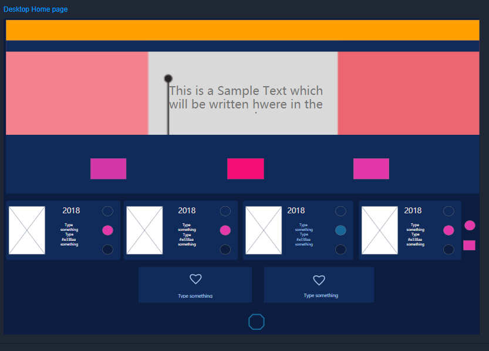
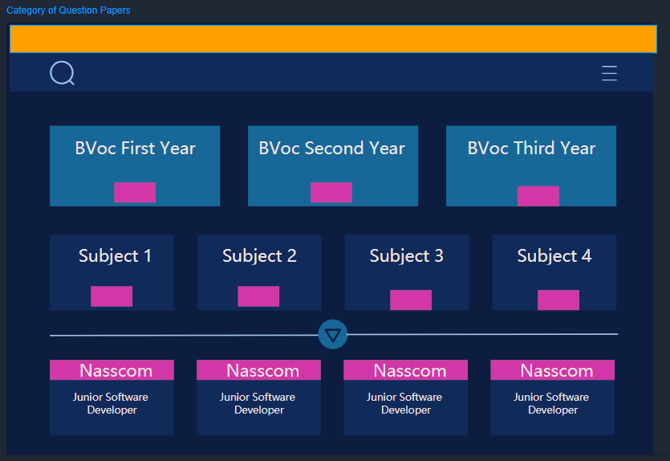
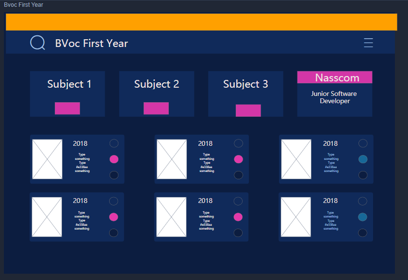
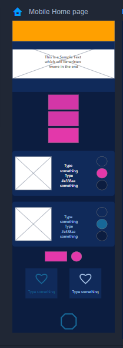
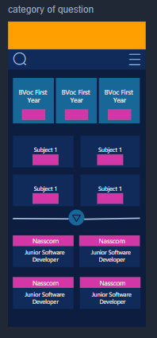

**Introduction** :
  It is a website about my Graduation Degree Course, namely B.Voc.(Bachelor of Vocational Studies).I wanted to make online old question papers library website.\
  My main focus was to build frontend of the website using my Prototype Designs.
  
**❤ Website URL** : https://papersbuddy.000webhostapp.com/index.html 

**Technologies and Tools used** : HTML, CSS, JavaScript, Mockplus (for Prototype Designs)

**Prototype Designs for Website : PROMPT**

My website is inspired by the below Prototype Designs of mine.

The actual website is 👆

**Desktop Prototype**\

 \
**Mobile Prototype**\

